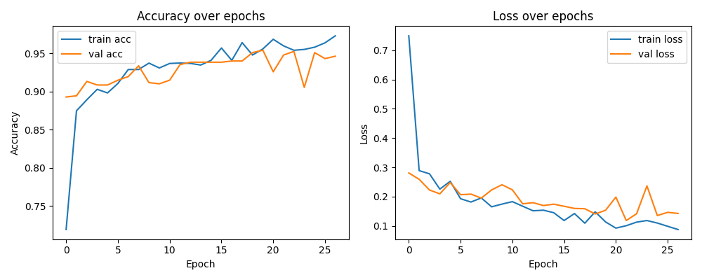

# Real-Time Crowd Anomaly Detector

A computer vision system that classifies video footage as violent or non-violent in real time, using transfer learning on MobileNetV2. Built to explore automated crowd monitoring - flagging anomalous behavior without needing a human watching every camera feed.

## Overview

- **Model:** MobileNetV2 (ImageNet pretrained, frozen base) + custom classification head
- **Task:** Binary classification - violent vs. non-violent
- **Input:** Video frames, resized to 150×150
- **Output:** Real-time violent/non-violent probability, overlaid on live webcam feed

## Architecture
MobileNetV2 (frozen) → GlobalAveragePooling2D → Dense(512, relu) → Dropout(0.5) → Dense(1, sigmoid)

- Total parameters: 2.91M (656K trainable, rest frozen)
- Data augmentation: rotation, shifts, shear, zoom, brightness jitter, horizontal flip
- Training safeguards: early stopping (patience=5), learning rate scheduling on plateau

## Results

| Metric | Value |
|---|---|
| Validation accuracy | **94.65%** (best: 95.43%) |
| Training accuracy | 97.32% |
| Epochs trained | 27 (early-stopped from max 30) |
| Training time | ~9 minutes (CPU) |
| Live inference latency | ~135 ms/frame |
| Live inference FPS | ~6.6 (end-to-end, CPU) |
| Model size | 16.5 MB |

Full metrics: [`metrics_report.json`](./metrics_report.json)

## Dataset

Trained on 2,543 images (training) and 635 images (validation) across two classes, sourced from a public violence-detection dataset and split via `ImageDataGenerator`.

## Files

- `FinalModel_with_metrics.py` - model definition, training pipeline, and live webcam inference with benchmarking
- `extract_frames.py` - utility to extract frames from raw video clips into an image dataset
- `metrics_report.json` - full training and inference metrics from the run above
- `training_curves.png` - accuracy/loss curves over training

## What I'd improve next

- Fine-tune the last few MobileNetV2 layers instead of freezing the entire base
- Train on a larger, more diverse dataset
- Quantize the model (TFLite) for faster inference on edge devices
- Wrap into a dashboard that logs alerts instead of a raw webcam overlay

## Write-up

I documented the full build process - including the environment/dependency debugging - in a blog post: [Building a Real-Time Crowd Anomaly Detector with MobileNetV2 and OpenCV](https://dev.to/sahasra_alugam/building-a-real-time-crowd-anomaly-detector-with-mobilenetv2-and-opencv-44d)
